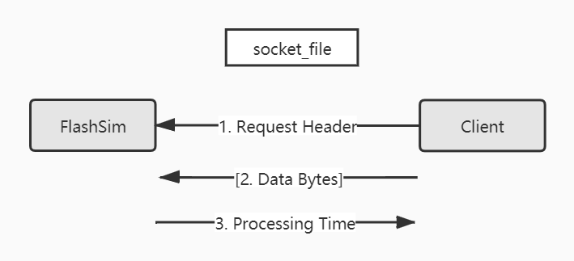
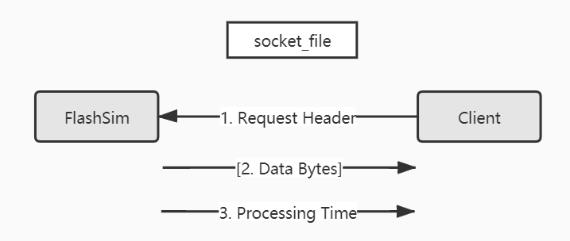

# FlashSim Event-Driven SSD Simulator


This is Guanzhou's extended FlashSim event-driven flash SSD simulator.


## Installation

Prerequisites:

- C++ Boost library: `sudo apt install libboost-all-dev`

Clone the repo:

```bash
$ git clone git@github.com:josehu07/flashsim.git
$ cd flashsim
```

Folder structure:

```text
--- SSD/         # SSD simulator main logic
 |- FTL/         # FTL algorithms are separated from main logic
 |- test/        # Example test runs
 |- standalone/  # Standalone version & an example client
 |- benchmark/   # Benchmarking utilities & some results
 |- Makefile
 |- COPYING
```

Run `make tests` to compile all provided test executables, and try some of them:

```bash
$ make
$ ./test2
$ make clean
```


## Usage

There are two ways to use the FlashSim simulator:

- As a C++ library, or
- As a standalone version and send reqeusts / receive responses through a strictly-defined socket API


### Library Version

For use with your own C++ projects and which only need one device configuration, take this simulator as a library and call the `Ssd::` APIs directly from your project. Follow provided test runs in `tests/` as a guidance.

1. Copy content of `ssd.conf` file to some location and tweak SSD device configurations
2. In your project, call:
   ```c++
   load_config(char *config_path);
   ```
   to load the config file. Note that `load_config()` will by default load an `ssd.conf` in current working directory
2. In your project, call:
   ```c++
   using namespace ssd;
   ssd_handle = new Ssd();
   ``` 
   to create a new instance of SSD. Then, call `Ssd::` class public APIs to simulate operating over a flash SSD. Most useful ones are:
   ```c++
   Ssd::event_arrive();       // Read / write event arrives at SSD at a given time
   Ssd::get_result_buffer();  // For retriving read request result data
   ```
3. Compile your project with FlashSim together & run


### Standalone Version

This functionality is added by Guanzhou Hu `<guanzhou.hu@wisc.edu>`, 2020.

For use with non-C++ projects or projects that need to simulate multiple SSD devices at the same time, compile FlashSim standalone version. Running it in a new shell will launch a new instance of the simulator (it will listen on requests indefinitely until `Ctrl+C`). Then, use a pre-defined Unix-domain socket protocol to send requests to / receive responses from the standslone simulator.

Notice that you can launch multiple instances, each opening a different socket file. Sending / receiving through different socket files allow your project to interact with multiple SSD devices at the same time.

1. Copy content of `ssd.conf` file to some location and tweak SSD device configurations
2. In the flashsim directory, build the standalone version:
   ```bash
   $ make  # You will have `./flashsim` available now
   ```
2. In a separate shell, run:
   ```bash
   $ ./flashsim SOCKET_NAME [CONFIG_PATH]
   ...

   # You can run multiple instances at the same time - In yet another shell:
   $ ./flashsim ANOTHER_SOCKET_NAME [ANOTHER_CONFIG_PATH]
   ...
   ```
3. In your project, send requests to & receive responses from the socket file through a strictly-defined Unix-domain socket protocol, as defined in the next section

Follow the example client code `standalone/client.cpp` as a guidance. You can run the example client by:

```bash
# In shell 1
$ make
$ ./flashsim simssd ssd.conf
...

# In shell 2
$ ./client simssd
# Now you will see both shells printing logs.
# The simulator won't exit until Ctrl+C in shell 1.
```

> ATTENTION:
>   1. For standalone version, unit of time in the configuration file MUST BE in milliseconds (ms).
>   2. If your client has concurrent threads issuing requests to a single device instance, make sure that the device is mutex locked so that socket messages do not interleave in order. You can simulate latency by sleeping in those client threads.

Please reference if you use for your research:

```bibtex
@article{flashsimstandalone,
    Author = {Guanzhou Hu},
    Title = {FlashSim Standalone},
    Url = {https://github.com/josehu07/flashsim},
    Year = 2020
}
```


## Standalone Socket Protocol

This section defines the Unix-domain socket protocol that the standalone FlashSim simulator uses. *Since sockets are language-independent, your projects are not restricted to C/C++ - even Python should work, as long as message bytes are exactly correct.*

For each request, messages MUST strictly follow the exact byte length and order.

To do a WRITE:



To do a READ:



Messages format details:

- Request Header:
  ```text
  +-----------+-----------------+----------+-----------------+
  | Direction | Logical address |   Size   | Start time (us) |
  | uint32_t  |    uint64_t     | uint32_t |    uint64_t     |  = 24 bytes
  |  4 bytes  |     8 bytes     |  4 bytes |     8 bytes     |
  +-----------+-----------------+----------+-----------------+
  ```
  where `Start time` is in microseconds (us) unit, and `Direction` can be:
    - `0` for READ;
    - `1` for WRITE.
- Data Bytes [This message presents IF AND ONLY IF the `PAGE_ENABLE_DATA` option in conf file is set to `1`; Otherwise, skip this message]:
  ```text
  +------------------------------+
  |         Data bytes           |
  |       pure bytearray         |  = the preceding header's `header->size` bytes
  | exactly `header->size` bytes |
  +------------------------------+
  ```
  If passing actual data, length of each request CANNOT EXCEED `65516` bytes, as this is the message size limit of UNIX-domain sockets.
- Processing Time Respond:
  ```text
  +----------------------+
  | Processing time (us) |
  |       uint64_t       |  = 8 bytes
  |        8 bytes       |
  +----------------------+
  ```
  where `Processing time` is in microseconds (us) unit.


## FTL Contribution From Matias

FTL algorithms under `FTL/` folder provide BAST, FAST and DFTL implementation. You can change in the config file which FTL algorithm to use.

Please also reference if you use for your research:

```bibtex
@article{extendedflashsim,
    Author = {Matias Bj{\o}rling},
    Title = {Extended FlashSim},
    Url = {https://github.com/MatiasBjorling/flashsim},
    Year = 2011
}
```


## Original README

Original FlashSim work is by Brendan Tauras btauras, Youngjae Kim, & Aayush Gupta at Pennsylvania State University.

```text
Copyright 2009, 2010 Brendan Tauras
btauras<code>at</code>gmail<code>dot</code>com

FlashSim is free software: you can redistribute it and/or modify
it under the terms of the GNU General Public License as published by
the Free Software Foundation, either version 3 of the License, or
any later version.

FlashSim is distributed in the hope that it will be useful,
but WITHOUT ANY WARRANTY; without even the implied warranty of
MERCHANTABILITY or FITNESS FOR A PARTICULAR PURPOSE.  See the
GNU General Public License for more details.

You should have received a copy of the GNU General Public License
along with FlashSim.  If not, see <http://www.gnu.org/licenses/>.

##############################################################################

README

To use FlashSim with a main file, use the "ssd" (default) make target
and link the object files with your code that contains a main function.  Some
 examples can be found in the "test" and "trace" make targets and corresponding
source files.

Users must provide their FTL scheme to run FlashSim, which should include a
FTL, wear-leveler, and garbage-collector class.  Please note that FLASHSIM WILL
NOT WORK WITHOUT PROVIDING A FTL SCHEME.  The UML diagram has been provided to
assist with FTL development.  Many private functions of the Controller class
made available to the FTL class will assist users in FTL development.  Users can
run the "test" and "trace" make target output binaries to perform basic
testing of their FTL schemes.

Before running the FlashSim module, users should update the configuration file
"ssd.conf" according to their specificiations.  Descriptions of configuration
settings can be found in the sample configuration file.

FlashSim was designed to be capable of being modularly integrated with Disksim.
The Ssd::event_arrive() function signature in ssd_ssd.cpp was designed to match
the event_arrive() function signature that Disksim uses to send events to disks.

Any questions, comments, suggestions, or code additions are welcome.
```
